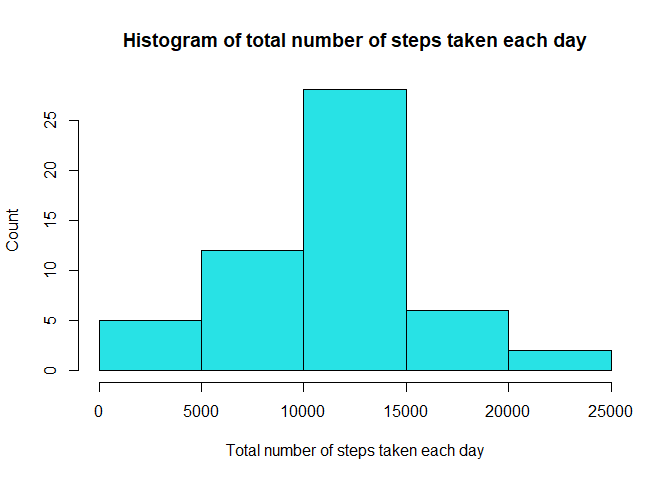
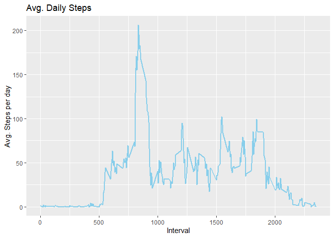
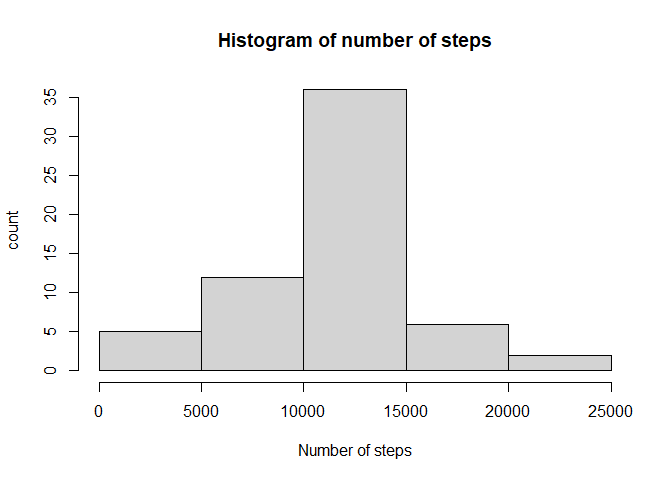
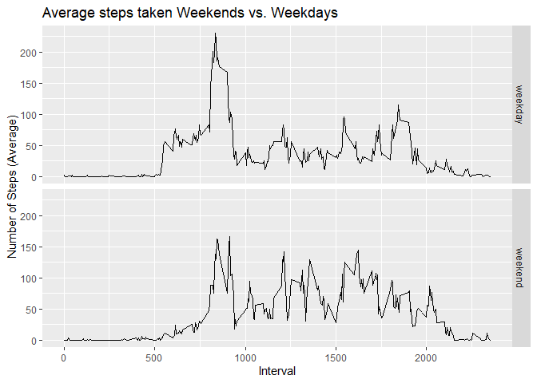

## Loading and preprocessing the data


```r
library(ggplot2)
data<-unzip("activity.zip")
data<-read.csv("activity.csv")
stepsdata <- na.omit(data) #remove NA data
stepsdata$date <- as.Date(stepsdata$date) #convert date into factor
```

## What is mean total number of steps taken per day?

Calculate the total number of steps taken per day


```r
y<-aggregate(x = stepsdata$steps,                # Specify data column
          by = list(stepsdata$date),              # Specify group indicator
          FUN = sum) 
head(y,10)
```

```
##       Group.1     x
## 1  2012-10-02   126
## 2  2012-10-03 11352
## 3  2012-10-04 12116
## 4  2012-10-05 13294
## 5  2012-10-06 15420
## 6  2012-10-07 11015
## 7  2012-10-09 12811
## 8  2012-10-10  9900
## 9  2012-10-11 10304
## 10 2012-10-12 17382
```

Histogram for the total number of steps per day


```r
hist(y$x, 
     xlab="Total number of steps taken each day", 
     ylab="Count", 
     main="Histogram of total number of steps taken each day",
     col=5)
```

<!-- -->

\#\#\#Calculate and report the mean and median of the total number of steps taken per day


```r
mean(y$x,na.rm=TRUE)
```

```
## [1] 10766.19
```

```r
median(y$x,na.rm=TRUE)
```

```
## [1] 10765
```

## What is the average daily activity pattern?

Find mean steps taken grouped by interval


```r
library(dplyr)
```

```
## Warning: package 'dplyr' was built under R version 4.0.5
```

```
## 
## Attaching package: 'dplyr'
```

```
## The following objects are masked from 'package:stats':
## 
##     filter, lag
```

```
## The following objects are masked from 'package:base':
## 
##     intersect, setdiff, setequal, union
```

```r
z<-stepsdata %>%
group_by(interval) %>%
summarize(mean_steps= mean(steps))
z
```

```
## # A tibble: 288 x 2
##    interval mean_steps
##       <int>      <dbl>
##  1        0     1.72  
##  2        5     0.340 
##  3       10     0.132 
##  4       15     0.151 
##  5       20     0.0755
##  6       25     2.09  
##  7       30     0.528 
##  8       35     0.868 
##  9       40     0     
## 10       45     1.47  
## # ... with 278 more rows
```

Time series plot


```r
ggplot(z, aes(x = interval , y = mean_steps)) + geom_line(color="sky blue", size=1) + labs(title = "Avg. Daily Steps", x = "Interval", y = "Avg. Steps per day")
```

<!-- -->

Find the interval with maximum mean of steps


```r
maxstepinterval <- z$interval[which.max(z$mean_steps)]
maxstepinterval
```

```
## [1] 835
```

## Imputing missing values
The number of missing values


```r
a<-nrow(data)
b<-nrow(stepsdata)
a-b
```

```
## [1] 2304
```

The number of missing values 2304

 Create a filled in dataset by assigning the average value for that time interval is NA is found.

```r
filldata <-data
for (i in 1:nrow(filldata)) {
    if (is.na(filldata$steps[i])) {
        # Find the index value for when the interval matches the average
        index <- which(filldata$interval[i] ==z$interval)
        # Assign the value to replace the NA
        filldata$steps[i] <- z[index,]$mean_steps
    }
}
filldata$date <- as.Date(filldata$date) 
```
Histogram of the total number of steps taken each day

```r
h<-filldata %>%
group_by(date) %>%
summarize(total_steps= sum(steps))

hist( h$total_steps, xlab="Number of steps", ylab="count", main="Histogram of number of steps")
```

<!-- -->
MEAN AND MEDIAN OF STEPS IN THE NEW DATASET

```r
fillmeansteps <- mean(h$total_steps)
fillmediansteps <- median(h$total_steps
                          )
fillmediansteps
```

```
## [1] 10766.19
```

The mean total number of steps per day is 10766.19 and the median is 10766.19.
## Are there differences in activity patterns between weekdays and weekends?

```r
# Make weekday variable
filldata$day <- weekdays(filldata$date)
# Define all days as weekdays
filldata$daytype <- "weekday"
# Fix days that are saturday or sunday to be weekends
filldata$daytype[filldata$day %in% c("Saturday", "Sunday")] <- "weekend"
```
Calculate the average weekday steps versus average weekend steps

```r
# Group data by 5 minute interval and summarize the average
# number of steps in that interval
dayaverage <- filldata %>%
    group_by(daytype, interval) %>%
    summarize(AverageSteps=mean(steps))
```

```
## `summarise()` has grouped output by 'daytype'. You can override using the `.groups` argument.
```

    

```r
qplot(interval, AverageSteps, data=dayaverage,
      type="l",
      geom="line",
      xlab="Interval",
      ylab="Number of Steps (Average)",
      main="Average steps taken Weekends vs. Weekdays",
      facets =daytype ~ .)
```

```
## Warning: Ignoring unknown parameters: type
```

<!-- -->


